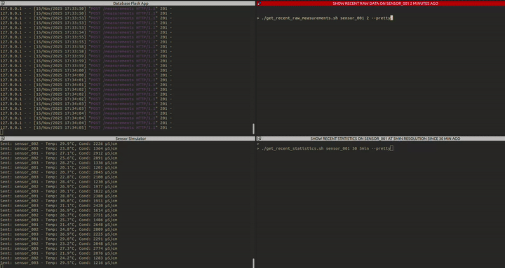

# Time Series Sensing Database - Sensor Data Management System

A backend system for ingesting, storing, and querying water quality sensor measurements with automatic time-series aggregation.

## Features

- RESTful API for sensor data ingestion and querying
- Automatic time-series aggregation (1-minute and 5-minute windows)
- Statistical metrics: avg, min, max, median, stddev, count
- Efficient time-range queries with automatic or manual resolution selection
- TimescaleDB for optimized time-series storage
- Configurable data retention policies
- Helper script for quick data queries

## Tech Stack

- **Backend**: Python 3.9+, Flask
- **Database**: PostgreSQL with TimescaleDB extension
- **Testing**: pytest

## Setup

### Prerequisites

- Docker and Docker Compose
- Python 3.9+

0. Docker (For launch database), jq for json parsing (make things pretty)
```
sudo snap install docker jq && sudo usermod -aG docker $USER
sudo apt-get install jq
```

1. Clone the repository and navigate to the project directory:
```bash
cd TimeSeriesSensingDatabase
```

2. (Optional) Edit config in environment file `.env`:

3. Run setup scripts. This will handle all the setup and docker pull for you.
```bass
sudo chmod +x setup.sh
./setup.sh
```

## Quick Start
### 1. Launch the database server
On one terminal launch the database server.
```
./start_database_server.sh
```
The API will be available at `http://localhost:5000`

### 2. Running the Sensor Simulator
In a separate terminal, lauch the sensor simulator.
```bass
./run_sensor_simulator.sh
```
Now go drink some coffee and wait for data to accumulate.

### 3. Test Database API with convenient scripst
In other serparate terminal, run these scripts with the `-h` flag to see instruction on how to use them.
```bass
./get_recent_raw_measurements.sh
./get_recent_statistics.sh
```



---
---
# API Documentation

### POST /measurements
Ingest sensor measurement data.

**Request Body:**
```json
{
  "sensor_id": "sensor_001",
  "timestamp": "2024-01-01T12:00:00Z",
  "temperature": 25.5,
  "conductivity": 1500
}
```

**Response:** `201 Created`
```json
{
  "message": "Measurement recorded"
}
```

**curl Example:**
```bash
curl -X POST http://localhost:5000/measurements \
  -H "Content-Type: application/json" \
  -d '{
    "sensor_id": "sensor_001",
    "timestamp": "2024-01-01T12:00:00Z",
    "temperature": 25.5,
    "conductivity": 1500
  }'
```

### GET /measurements
Query raw measurements by sensor and time range.

**Query Parameters:**
- `sensor_id` (required): Sensor identifier
- `start` (required): Start time in ISO 8601 format
- `end` (required): End time in ISO 8601 format

**Response:** `200 OK`
```json
{
  "sensor_id": "sensor_001",
  "start": "2024-01-01T12:00:00+00:00",
  "end": "2024-01-01T13:00:00+00:00",
  "count": 120,
  "measurements": [
    {
      "timestamp": "2024-01-01T12:00:00+00:00",
      "sensor_id": "sensor_001",
      "temperature": 25.5,
      "conductivity": 1500
    }
  ]
}
```

**curl Example:**
```bash
curl "http://localhost:5000/measurements?sensor_id=sensor_001&start=2024-01-01T12:00:00Z&end=2024-01-01T13:00:00Z"
```

### GET /statistics
Query aggregated statistics with automatic or manual resolution selection.

**Query Parameters:**
- `sensor_id` (required): Sensor identifier
- `start` (required): Start time in ISO 8601 format
- `end` (required): End time in ISO 8601 format
- `resolution` (optional): Force resolution ('1min' or '5min', default: auto-select)

**Response:** `200 OK`
```json
{
  "sensor_id": "sensor_001",
  "start": "2024-01-01T12:00:00+00:00",
  "end": "2024-01-01T13:00:00+00:00",
  "resolution": "1min",
  "count": 60,
  "statistics": [
    {
      "timestamp": "2024-01-01T12:00:00+00:00",
      "sensor_id": "sensor_001",
      "temperature": {
        "avg": 25.5,
        "min": 25.0,
        "max": 26.0,
        "median": 25.4,
        "stddev": 0.3
      },
      "conductivity": {
        "avg": 1500.0,
        "min": 1450,
        "max": 1550,
        "median": 1495,
        "stddev": 25.5
      },
      "count": 10
    }
  ]
}
```

**curl Examples:**
```bash
# Auto-select resolution
curl "http://localhost:5000/statistics?sensor_id=sensor_001&start=2024-01-01T12:00:00Z&end=2024-01-01T13:00:00Z"

# Force 1-minute resolution
curl "http://localhost:5000/statistics?sensor_id=sensor_001&start=2024-01-01T12:00:00Z&end=2024-01-01T13:00:00Z&resolution=1min"

# Force 5-minute resolution
curl "http://localhost:5000/statistics?sensor_id=sensor_001&start=2024-01-01T12:00:00Z&end=2024-01-01T13:00:00Z&resolution=5min"
```

## Resolution Selection

The system automatically selects the appropriate aggregation resolution based on query time range:
- **1-minute resolution**: For time ranges ≤ 1 hour (configurable)
- **5-minute resolution**: For time ranges > 1 hour

You can also manually force a specific resolution using the `resolution` parameter.

Configuration in `.env`:
- `HIGH_RES_THRESHOLD_HOURS`: Threshold for automatic resolution selection (default: 1)

## Testing

### Run Unit Tests
```bash
pytest
```

### Run with Coverage
```bash
pytest --cov=app tests/
```

### Quick Data Query Script
Query last 15 minutes of data:
```bash
# Raw measurements (default)
python read_last_15min.py

# Specific sensor
python read_last_15min.py --sensor sensor_002

# Aggregated statistics
python read_last_15min.py --type statistics

# Force resolution
python read_last_15min.py --type statistics --resolution 1min

# All options
python read_last_15min.py -s sensor_003 -t statistics -r 5min

# Show help
python read_last_15min.py -h
```

## Configuration

Edit `.env` to customize:

- `DATABASE_URL`: PostgreSQL connection string
- `RAW_DATA_RETENTION_DAYS`: How long to keep raw measurements (default: 7, requires manual setup)
- `ONE_MIN_RETENTION_DAYS`: How long to keep 1-minute aggregates (default: 30, requires manual setup)
- `FIVE_MIN_RETENTION_DAYS`: How long to keep 5-minute aggregates (default: 365, requires manual setup)
- `HIGH_RES_THRESHOLD_HOURS`: Threshold for automatic resolution selection (default: 1)

**Note:** Retention policies must be manually enabled in the database. See "Data Retention" section below.

## Error Handling

The API returns appropriate HTTP status codes:
- `200 OK`: Successful query
- `201 Created`: Measurement recorded
- `400 Bad Request`: Invalid input or parameters
- `404 Not Found`: Endpoint not found
- `500 Internal Server Error`: Database or server error

## Data Retention

By default, all data is kept indefinitely. To enable automatic cleanup:

```bash
# Enter database
docker exec -it sensors_timescaledb psql -U database_user -d database_lab

# Add retention policies
SELECT add_retention_policy('measurements', INTERVAL '7 days');
SELECT add_retention_policy('measurements_1min', INTERVAL '30 days');
SELECT add_retention_policy('measurements_5min', INTERVAL '365 days');

# Exit
\q
```

This will automatically delete data older than the specified intervals.

## Stopping the System

```bash
# Stop Flask app: Ctrl+C in the terminal

# Stop sensor simulator: Ctrl+C in the terminal

# Stop database
docker-compose down
```

## Architecture

See [ARCHITECTURE.md](ARCHITECTURE.md) for detailed design decisions and implementation details.
